<p align="center">
  <picture>
    <source media="(prefers-color-scheme: dark)" srcset="docs/assets/banner-dark.svg">
    <source media="(prefers-color-scheme: light)" srcset="docs/assets/banner-light.svg">
    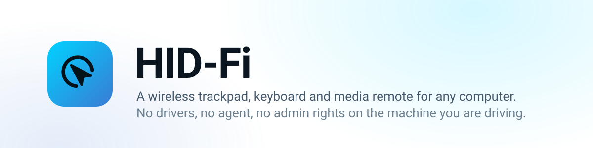
  </picture>
</p>

# HID-Fi

**Turn a small dev board into a wireless trackpad, keyboard, media remote and
gamepad for any computer — with nothing installed on that computer.**

The board plugs into a PC over USB and presents itself as a keyboard and mouse. It
also runs its own WiFi access point serving a dashboard. Open that dashboard on
your phone and you are driving the PC.

Because it is a plain USB HID device, the host needs **no drivers, no agent and no
admin rights**. It works on the lock screen, in the BIOS, and on machines you have
no rights to install anything on.

```
     phone  ──WiFi──▶  ESP32-S3 N16R8  ──USB HID──▶  the PC
  (dashboard)             (this repo)          (sees a keyboard and mouse)
```

> [!IMPORTANT]
> **This is an ESP32-S3 project, tested on one board: the YD-ESP32-S3 N16R8.**
> Being a keyboard and mouse needs the S3's native USB peripheral, which the
> original ESP32, the S2, C3, C6 and H2 either lack or expose differently.
> Everything here is built and tested on an **ESP32-S3 N16R8** (16 MB flash,
> 8 MB OPI PSRAM) and nothing else — no other chip has been tried, and no other
> board has been verified.

---

## Watch the build

[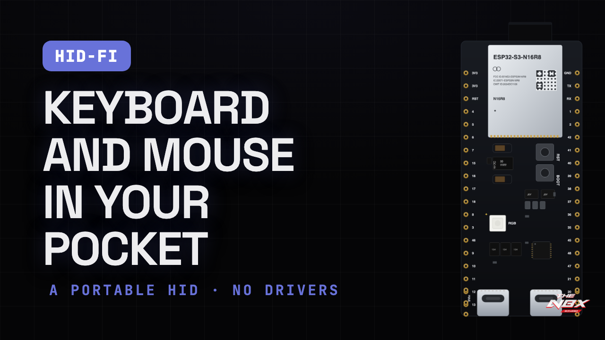](https://www.youtube.com/watch?v=HUG3y0nIfkw)

From a blank ESP32-S3 board to driving a computer from your phone: the two USB-C
ports, installing the tools on Windows and macOS, flashing with one command, and a
tour of the dashboard.
**[Watch on YouTube](https://www.youtube.com/watch?v=HUG3y0nIfkw)** (9:39)

---

## Contents

- [Watch the build](#watch-the-build)
- [What it does](#what-it-does)
- [The dashboard](#the-dashboard)
- [What you need](#what-you-need)
- [The two USB ports are not interchangeable](#the-two-usb-ports-are-not-interchangeable)
- [Quick start](#quick-start)
- [Change the password first](#change-the-password-first)
- [Recommended setup](#recommended-setup)
- [Mac or PC, worked out for you](#mac-or-pc-worked-out-for-you)
- [How it works](#how-it-works)
- [Documentation](#documentation)
- [FAQ](#faq)
- [Contributing](#contributing)
- [License](#license)

---

## What it does

| | |
|---|---|
| **Trackpad** | One finger moves, tap clicks, two fingers scroll and pinch, three swipe desktops. Press and hold to grab a window. Speed, acceleration, momentum and scroll direction all adjustable. |
| **Keyboard on the pad** | The trackpad card flips to a keyboard and back from one button, so a click and the typing that follows it do not cost a trip across the app. |
| **Keyboard** | On-screen keys with real press and release, so you can hold Ctrl with one thumb and strike another key with the other. It scales with the screen: a phone gets letters and a symbol layer, a laptop gets a full ANSI board, and a wide screen gets the function row, the navigation cluster and the numpad — all 104 keys. Type a whole string, or fire a custom combo. |
| **Mouse** | Left, right and a scroll wheel you actually drag — each notch is a detent with a haptic tick, and a tap on it middle-clicks. |
| **Passwords** | A vault on the board for the passwords and PINs you keep typing. It types them for you, so they never touch a keyboard that could be watched or logged. Guarded by a PIN that is asked for **every** time — including to type one — and optionally by a PIN of its own, separate from the one that unlocks the dashboard. |
| **Shortcuts** | Hundreds of macOS, Windows and Linux shortcuts, grouped, searchable, and filtered to the OS you pick. Tap one and it fires on the PC. |
| **App switcher** | Hold the tile and Alt stays down, so the host keeps its own switcher open. Slide to pick a window, let go to raise it. |
| **Media** | Volume knobs you turn with a finger, playback keys, brightness, and editable quick actions for mic-mute and call keys. |
| **Gamepad** | Optional second USB device: two sticks, D-pad, twelve buttons. |
| **Session** | Unlock a locked PC by typing its password, lock it again, sleep and wake, presenter controls, and a net-zero cursor jiggle to stay awake. Saved PCs remember whether they are a Mac or a PC, so each one is woken the way its own login screen expects. |
| **Knows the computer** | Detects whether it is plugged into a Mac or a PC from the way the host reads its USB descriptors — typing nothing to find out — and switches the lock shortcut, gestures, app switcher and keyboard to match. Or pin it by hand. See [docs/MACOS.md](docs/MACOS.md). |
| **Knows itself** | Both MAC addresses, what is in the board's permanent memory, and every client on its access point — without ever handing back a password or PIN. |

Flick sideways across empty space to move between tabs. It is deliberately fussy:
it will not fire on the trackpad, on a key, during a hold, or on anything slower
than a flick.

Everything you customise — knobs, quick actions, macros, saved PCs — is stored
**on the board**, so every phone that opens the dashboard sees the same setup.

---

## The dashboard

It runs in your phone's browser, served from the board itself — nothing to
install. It adapts to the computer it is plugged into and works out which on its
own: a Mac gets Mac keys, shortcuts and gestures, a PC gets Windows ones.

<table>
<tr>
<td align="center" width="25%">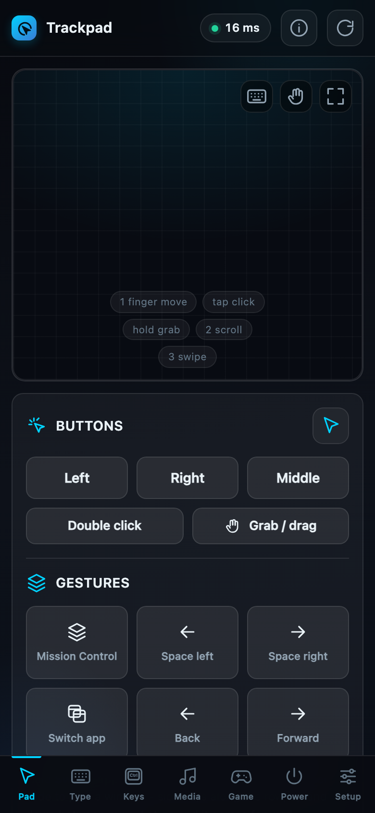<br><b>Trackpad</b><br><sub>Move, tap, two-finger scroll, pinch, three-finger gestures</sub></td>
<td align="center" width="25%">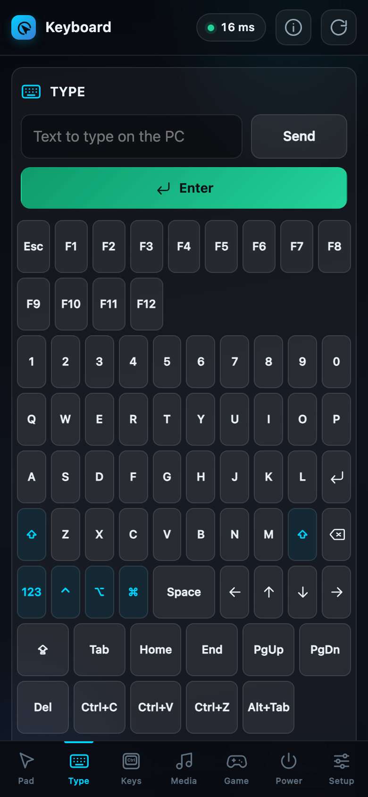<br><b>Keyboard</b><br><sub>Full keyboard, both Shifts, Mac or PC keys</sub></td>
<td align="center" width="25%">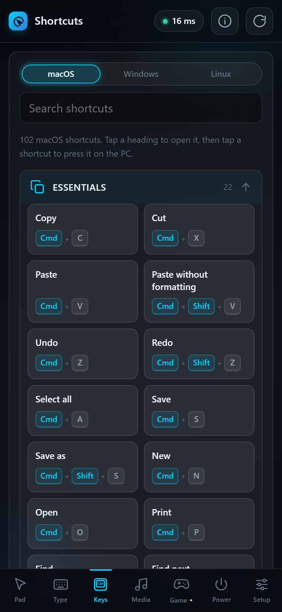<br><b>Keys</b><br><sub>Password vault, and hundreds of shortcuts</sub></td>
<td align="center" width="25%">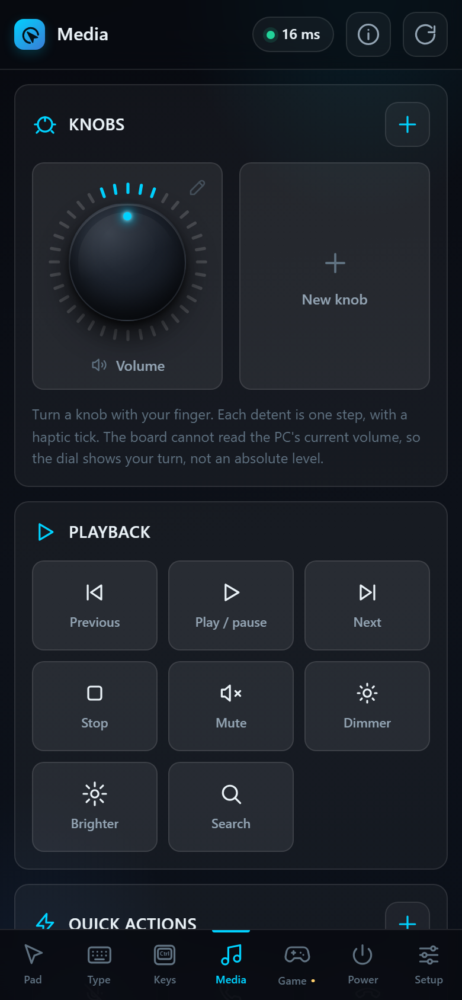<br><b>Media</b><br><sub>Volume knobs, playback, quick actions</sub></td>
</tr>
<tr>
<td align="center" width="25%">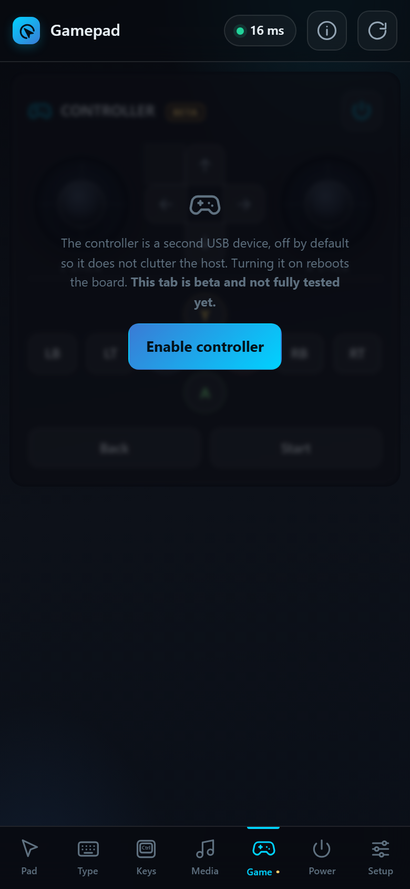<br><b>Gamepad</b><br><sub>Two sticks, D-pad, twelve buttons</sub></td>
<td align="center" width="25%">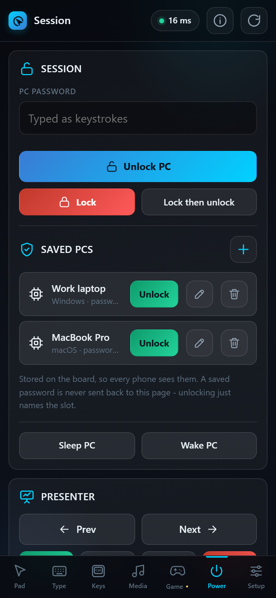<br><b>Session</b><br><sub>Unlock, lock, sleep, wake, presenter</sub></td>
<td align="center" width="25%">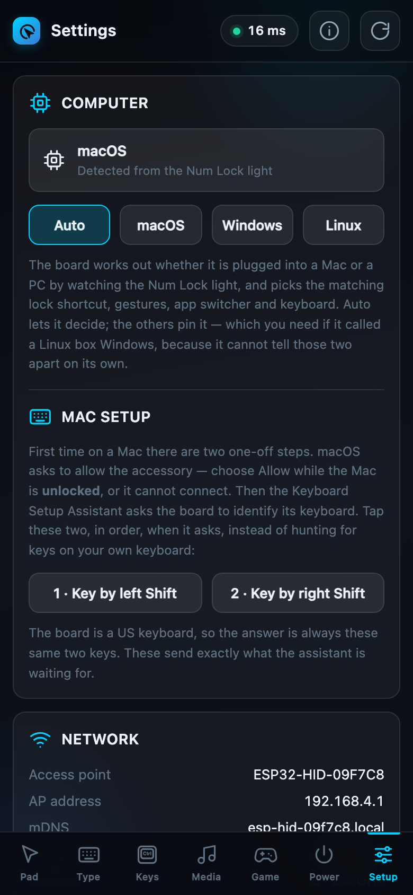<br><b>Settings</b><br><sub>Auto-detects Mac/PC, network, access PIN</sub></td>
<td align="center" width="25%"></td>
</tr>
</table>

### The keyboard grows with the screen

It is not one keyboard scaled up and down. The layout gains whole blocks as the
width allows, the way physical keyboards do &mdash; so a big screen gets *more
keys*, not the same few keys stretched across it.

| Width | Layout | Like a… |
|---|---|---|
| under 500px | Letters, a `123` symbol layer, function row, real inverted-T arrows | phone keyboard |
| 500px+ | Full **ANSI**: `` ` `` `-` `=` `[` `]` `\` `;` `'` `,` `.` `/`, both Shifts, function row, arrows, `Del`/`Home`/`End` and `Ins`/`PgUp`/`PgDn` | 65% keyboard |
| 1010px+ | …plus the full **navigation cluster** (`PrtSc`/`ScrLk`/`Pause`) | TKL |
| 1300px+ | …plus the **numpad** &mdash; 104 keys | full-size |

Rotating a phone to landscape, or opening the trackpad card's keyboard in
fullscreen, moves up the tiers too. **Going up a tier never takes a key away** —
every layout can reach everything the smaller one could, and a test sweeps 67
viewports to prove it.

---

## What you need

- **An ESP32-S3 N16R8 board with two USB-C ports.** Built and tested on the
  YD-ESP32-S3 N16R8 (16 MB flash, 8 MB OPI PSRAM). The board used by the author:
  [amzn.in/d/0b1t9Zab](https://amzn.in/d/0b1t9Zab) *(Amazon India)*.
- **Two USB-C data cables.** Both must carry data. A charge-only cable is the
  single most common reason nothing works.
- **A computer to flash from**, with [arduino-cli](https://arduino.github.io/arduino-cli/).

**Only the ESP32-S3 N16R8 has been tested.** The firmware is compiled for it,
uses the S3's native USB peripheral to be a HID device, and has run on nothing
else. Other ESP32 variants are not a matter of a different board setting — the
original ESP32 and the C3, C6 and H2 have no USB device peripheral capable of
this at all.

Other ESP32-S3 boards with a native USB port should work, and a different flash
or PSRAM size only needs a different `PartitionScheme` and `PSRAM` flag at build
time — but none has been tried. [docs/HARDWARE.md](docs/HARDWARE.md) explains
what actually matters and what to check before buying something else — and if you
do test one, please say so, it is the most useful report you can send.

---

## The two USB ports are not interchangeable

This is the thing that trips up almost everyone. The board has two USB-C sockets
and they do completely different jobs:

| Port | Marked | What it is | Use it for |
|---|---|---|---|
| One side | **COM** | CH343 USB-to-serial bridge | **Flashing**, and serial control |
| Other side | **USB** | The ESP32-S3's own USB peripheral | **Being the keyboard and mouse** |

- Flash over **COM**.
- Once flashed, plug **USB** into the machine you want to control.
- To flash *and* control the same machine, plug both in.

If you flash successfully but the PC never sees a keyboard, you are almost
certainly still on the COM port. Full detail in
[docs/HARDWARE.md](docs/HARDWARE.md).

---

## Quick start

> **Never flashed an ESP board before?** [docs/FLASHING.md](docs/FLASHING.md#install-the-tools-first-time-only)
> walks you through installing the tools from zero — `arduino-cli`, the ESP32
> support, the USB driver — all step by step.

**1. Flash it**, with the board on its **COM** port. Copy the whole block.

<details open>
<summary><b>Windows</b> (PowerShell)</summary>

```powershell
# One time only: tools, ESP32 support and the two libraries (~1 GB, a few minutes)
winget install ArduinoSA.CLI
arduino-cli core update-index
arduino-cli core install esp32:esp32
arduino-cli lib install ArduinoJson
arduino-cli lib install WebSockets

# Every time: get the code and flash
git clone https://github.com/san-gitlogin/HID-Fi
cd HID-Fi
Set-ExecutionPolicy -Scope Process -ExecutionPolicy Bypass -Force
.\flash_esp.ps1 -Compile
```

Windows also needs the **CH343 driver** once, from
[wch-ic.com](https://www.wch-ic.com/downloads/CH343SER_EXE.html) — replug the
board after installing it. The `Set-ExecutionPolicy` line applies to that one
PowerShell window only; nothing is changed permanently.

</details>

<details open>
<summary><b>macOS</b> (Terminal)</summary>

```bash
# One time only: tools, ESP32 support and the two libraries (~1 GB, a few minutes)
brew install arduino-cli
arduino-cli core update-index
arduino-cli core install esp32:esp32
arduino-cli lib install ArduinoJson
arduino-cli lib install WebSockets

# Every time: get the code and flash
git clone https://github.com/san-gitlogin/HID-Fi
cd HID-Fi
chmod +x flash_esp.sh
./flash_esp.sh -c
```

macOS usually needs no driver. If no port shows up, install
[WCH's macOS driver](https://www.wch-ic.com/downloads/CH343SER_MAC_ZIP.html).

</details>

<details>
<summary><b>Linux</b></summary>

```bash
curl -fsSL https://raw.githubusercontent.com/arduino/arduino-cli/master/install.sh | sh
arduino-cli core update-index
arduino-cli core install esp32:esp32
arduino-cli lib install ArduinoJson
arduino-cli lib install WebSockets

git clone https://github.com/san-gitlogin/HID-Fi
cd HID-Fi
chmod +x flash_esp.sh
./flash_esp.sh -c
```

If you get a permission error on the serial port, run
`sudo usermod -aG dialout $USER`, then log out and back in.

</details>

Already set up? Flashing is just the last line: `.\flash_esp.ps1 -Compile` on
Windows, `./flash_esp.sh -c` elsewhere. The script finds the board, the toolchain
and esptool by itself. **On a Mac there are two one-time setup steps** — the
accessory prompt and the keyboard assistant — covered in
[docs/MACOS.md](docs/MACOS.md).

**2. Plug the USB port** into the computer you want to control.

**3. Connect your phone** to the WiFi network **`ESP32-HID-XXXXXX`**, password
`hid12345`, then open **<http://192.168.4.1/>**.

`XXXXXX` is the last three bytes of that board's MAC address, so several boards
never collide.

**4. Change the password.** Read the next section — this one matters.

---

## Change the password first

> [!WARNING]
> Every board flashed with this firmware starts with the **same** access point
> password, `hid12345`, and it is printed in this README. Until you change it,
> anyone in WiFi range who has seen this project can type on your computer.

Both settings are in the **Settings** tab:

**1. Change the access point.**
Settings → Access point → new name and password → *Change access point*.
Minimum 8 characters. The access point restarts immediately, so your phone drops
off the network. The dashboard shows a full-screen panel with the new name and
password and reconnects by itself once you rejoin.

**2. Set an access PIN.**
Settings → Access PIN → four digits → *Set PIN*.

The PIN gates every wireless request. Four digits is only 10,000 combinations, so
the board **locks out for longer after each wrong guess** — one free retry, then
5s, 15s, 60s, then five minutes per attempt. Walking the whole keyspace would take
about a month.

**USB serial is never gated and never locked out.** If you forget the PIN or lock
yourself out, plug into the COM port and set a new one over serial. That is the
deliberate way back in. The one exception is reading a stored password back out
of the vault — that asks for a PIN even over the cable.

### Joining your home network is not the same as using the access point

The board can run its own access point and be joined to your home network at the
same time, and both routes work at once. But they are not equally safe.

On the access point, an attacker has to be within WiFi range of you. On your home
network, **every device on that network can reach the board** — the smart TV, a
guest's laptop, anything already compromised. Nothing about the dashboard looks
different, so the firmware enforces the difference instead of just warning:

> Once the board is on a home network, wireless control from outside its own
> access point is **refused until a PIN is set**. Reading status and setting the
> PIN stay available, so you can fix it from where you are standing.

More detail, including what this project does *not* protect against, in
[SECURITY.md](SECURITY.md).

---

## Recommended setup

Five minutes, in this order. Everything here is in the **Settings** tab unless
it says otherwise.

| # | Do this | Why it matters |
|---|---|---|
| 1 | **Change the access point name and password** | Every board ships with `hid12345`, printed in this README. Until you change it, anyone in range who has seen this project can type on your computer. A distinctive name also stops you joining someone else's board by mistake. |
| 2 | **Set a four digit access PIN** | It gates every wireless request, with an escalating lockout behind it. Nothing else on this list works without it — saving a PC password or a vault entry is refused until a PIN exists. |
| 3 | **Decide how you will reach it** | The board's **own access point** is the safer default: an attacker has to be in radio range. Joining your home network is more convenient and strictly more exposed — see below. |
| 4 | **Give the vault its own PIN** *(Keys → Passwords)* | Then unlocking the dashboard stops being the same thing as unlocking your stored passwords, the way a browser asks again before showing one. |
| 5 | **Turn the access point off when you are on a network** *(Power)* | An access point beacons whether anyone is listening or not. Holding **BOOT** for two seconds always brings it back. |
| 6 | **Unplug it when you are not using it** | It is a keyboard that someone in range might be able to type on. |

**If you do join a home network:**

- Set the PIN **first**, from the access point, before joining. The firmware will
  refuse wireless control from the wider network until you have, but doing it in
  the right order saves you a puzzle.
- Prefer a **guest or IoT network** that cannot reach your main machines.
- Give it a **static address** so you can find it in the router's client list and
  firewall it if you want to.
- Remember there is **no TLS**. Anyone already on that network can read the
  traffic, including a password as you type it into the unlock field. Treat the
  network itself as the security boundary.

**What the board will never do**, whichever route you use: hand a saved PC
password back, or hand a vault secret back without the PIN for that specific
request — on WiFi or over the USB cable. Full reasoning in
[SECURITY.md](SECURITY.md).

---

## Mac or PC, worked out for you

Plug the board into a computer and it watches how that computer reads the USB
descriptors it is being offered — it never types anything to find out — then
switches the lock shortcut, the gestures, the app switcher and the key caps to
match. A Mac gets `⌘ ⌥ ⌃`, a PC gets Ctrl/Alt/⊞.

<table>
<tr>
<td width="50%" align="center">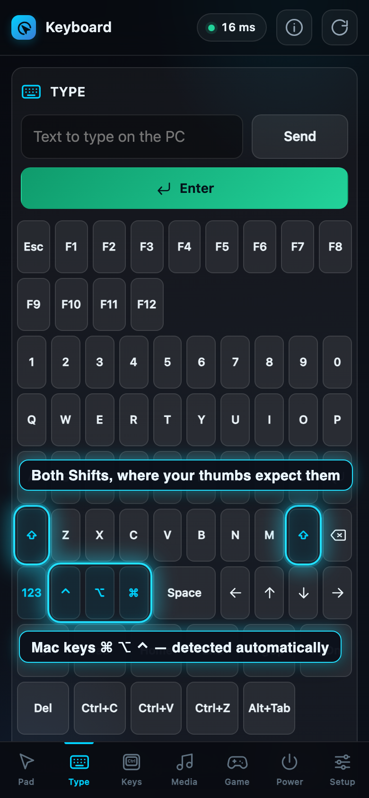</td>
<td width="50%" align="center">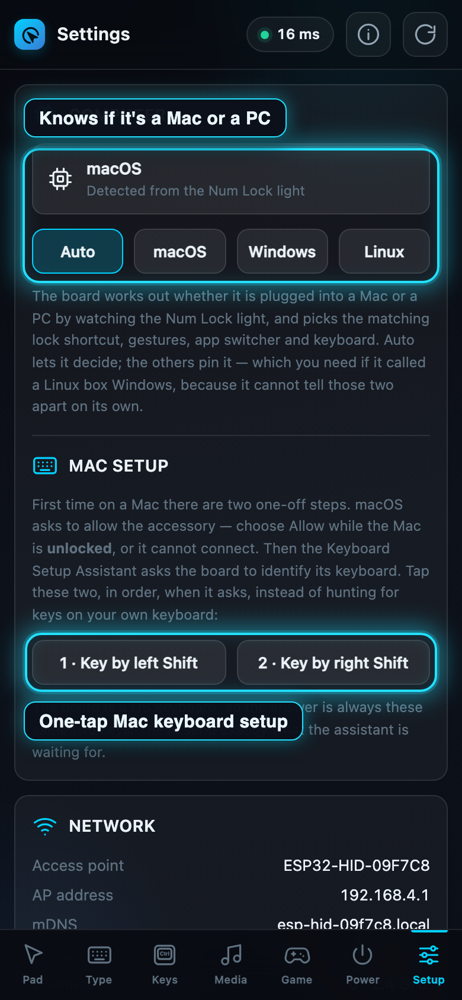</td>
</tr>
<tr>
<td align="center"><sub>Mac modifier glyphs, picked automatically</sub></td>
<td align="center"><sub>Settings &rarr; Computer, and the one-tap macOS keyboard setup</sub></td>
</tr>
</table>

Detection re-runs whenever the board is moved to another computer, and **you can
always pin the OS by hand** in Settings → Computer if it gets it wrong. Two
honest limits: Linux enumerates exactly as Windows does, so it reads as Windows
until you pin it, and a computer that has already cached this board's
descriptors may not say enough to be recognised — in which case the dashboard
says so and asks you to pick, rather than guessing.

**macOS also has two one-time setup steps** the first time you plug in: allowing
the accessory, and the Keyboard Setup Assistant. The dashboard drives both, and
[docs/MACOS.md](docs/MACOS.md) covers them.

---

## Power

Almost all of this board's draw is the radio, not the processor: roughly
100–120 mA with WiFi awake against 30–40 mA with modem sleep on.

That is an awkward tradeoff, because keeping the radio awake is exactly what makes
the pointer feel instant. Modem sleep parks the radio between router beacons and
you can see the stutter. So rather than making you choose once and live with it,
the default decides per moment.

| Mode | What it does |
|---|---|
| Performance | Radio always awake. Lowest latency, highest draw. |
| **Balanced** *(default)* | Awake while a dashboard is connected, asleep once none is. Costs nothing you can feel. |
| Saver | Radio always asleep. Lowest draw, and the pointer stutters. |

The bigger saving is **turning the access point off when it is unused**. An access
point beacons whether or not anyone is listening, so once the board is reachable
over your home network the AP is pure cost — and pure attack surface. Turn it on
in Settings → Power. **Holding BOOT for two seconds always brings it back**, which
is the guaranteed way in if anything goes wrong.

CPU frequency scaling is deliberately not offered. It saves far less than the
radio does, and it changes the clock the serial port derives from — not worth
risking the cable that is your recovery path for a few milliamps.

---

## How it works

Three ways in, one way out. All three speak the same JSON commands:

```
serial (CH343, 115200)   ─┐
HTTP   :80 /api/command   ─┼─▶  command dispatch  ─▶  USB HID  ─▶  the PC
WebSocket :81             ─┘
```

- **WebSocket** carries pointer, joystick and knob traffic as **binary frames**.
  This matters more than it sounds: the ESP32 core's `WebServer` has no HTTP
  keep-alive, so one POST per pointer event costs a full TCP handshake. That was
  the difference between a laggy cursor and a smooth one.
- **HTTP** serves the dashboard and stays as a fallback for commands.
- **Serial** is never gated by the PIN, so a cable is always a way back in.

**Nothing in the main loop is allowed to block.** That loop services the socket,
the web server and the pointer stream, so anything that waits freezes the
dashboard — and a long enough freeze drops the connection. Joining a network and
scanning for networks both used to block for seconds; both are now state machines
that report progress the dashboard polls and narrates live.

Settings live in NVS and survive a reboot *and* a firmware upgrade —
`flash_esp.ps1` deliberately writes only the four firmware partitions and leaves
NVS alone.

More in [docs/ARCHITECTURE.md](docs/ARCHITECTURE.md).

---

## Documentation

| Document | What is in it |
|---|---|
| [docs/HARDWARE.md](docs/HARDWARE.md) | The board, the two ports, cables, the RGB LED, power |
| [docs/FLASHING.md](docs/FLASHING.md) | Flashing from nothing, rebuilding, troubleshooting |
| [docs/MACOS.md](docs/MACOS.md) | Mac setup — the accessory prompt, the keyboard assistant, and what auto-switches |
| [docs/COMMANDS.md](docs/COMMANDS.md) | Every JSON command and WebSocket opcode |
| [docs/ARCHITECTURE.md](docs/ARCHITECTURE.md) | How the firmware and dashboard fit together |
| [SECURITY.md](SECURITY.md) | Threat model, and what is deliberately not protected |
| [CONTRIBUTING.md](CONTRIBUTING.md) | Building, testing, and the constraints that will bite you |

---

## FAQ

**Does the computer need any software, drivers or admin rights?**
No. The board is a standard USB HID keyboard and mouse, so the host uses the
drivers it already has. That is why it works on the lock screen, in the BIOS, and
on machines you cannot install anything on.

**Does it work with a Mac?**
Yes. It detects a Mac automatically — passively, from how macOS sets up the
keyboard, without pressing anything — and switches the lock shortcut, gestures,
app switcher and keyboard to match. There are two one-time Mac setup steps the
first time you plug in — see [docs/MACOS.md](docs/MACOS.md).

**Windows too?**
Yes, and it is plug-and-play there. Everything that changes for a Mac stays as
Windows expects when it detects a PC. You can also pin the OS by hand in
**Settings → Computer**.

**It flashed fine, but the computer never sees a keyboard.**
You are almost certainly still on the **COM** port. Flash over COM, then plug the
**USB** port into the computer you want to control. A charge-only cable does the
same thing — use a data cable. See [the two USB ports](#the-two-usb-ports-are-not-interchangeable).

**The cursor has gone laggy. What do I do?**
Close the dashboard tab and open it again. That clears it. Lag that creeps in
after a tab has been sitting open for hours is a browser-side problem, not the
board — check the **ms** pill in the top bar, and if it still reads normal while
the cursor feels slow, the round trip is fine and the tab is the thing to
replace. The pill beside it tells you how many dashboards are connected; more
than one phone driving the board at once will also cost you smoothness, and it
turns amber to say so.

**Can the board read my screen, or tell if the PC is locked?**
No. HID is one-way: the board only sends input, it can never read the host back.
Anything the dashboard shows about the computer — volume, mute, lock state — is
what it *believes* it set, not what it observed.

**Is it secure?**
Out of the box, no — every board ships with the same access-point password.
Change it and set a 4-digit PIN, both in Settings, before using it for anything
that matters. See [SECURITY.md](SECURITY.md).

**My keyboard isn't a US layout — will passwords type correctly?**
Not yet. The board types US-layout ASCII, so symbols and passwords come out wrong
on other layouts. This is the most valuable open problem in the project.

**Will it work on an ESP32 board I already have?**
Only the ESP32-S3 N16R8 has been tested. Being a keyboard needs the S3's native
USB peripheral, which the original ESP32 and the C3/C6/H2 do not have. See
[docs/HARDWARE.md](docs/HARDWARE.md).

**Where are my settings kept, and do they survive a firmware upgrade?**
On the board, in NVS. A normal flash writes only the firmware and leaves them
alone; only a full erase clears them.

---

## Contributing

Issues and pull requests are welcome, and so is simply telling me it broke on your
board.

**If this is useful to you, please star the repo.** It is the main signal that
tells me whether to keep working on it.

Fork it, build something, send it back if others would want it.
[CONTRIBUTING.md](CONTRIBUTING.md) covers the build, the test suites, and the two
hardware constraints that are not obvious from the code.

Good places to start:

- **Keyboard layouts other than US.** The board types US-layout ASCII today, so
  passwords and symbols come out wrong on other layouts. This is the most
  valuable open problem.
- **More shortcuts**, especially Linux desktops beyond GNOME.
- **Testing on other ESP32-S3 boards** and reporting what needed to change.

---

## License

**[PolyForm Noncommercial 1.0.0](LICENSE.md)** — free for personal projects, hobby
use, study, research, charities, schools and government bodies. Keep the copyright
notice and you are fine.

**Commercial use needs a separate license.** If you want to sell boards with this
on them, ship it inside a product, or use it as part of paid work, get in touch
and we will agree terms — usually a flat fee or a revenue share depending on what
you are building.

This is **source-available, not OSI open source**. That is deliberate: the work
took real effort, and I would rather share it openly with one condition attached
than not share it at all.

---

## Credits

Built by **Santhosh**.

If you build on this, credit is required by the license and appreciated well
beyond it. A link back to this repo is enough.
